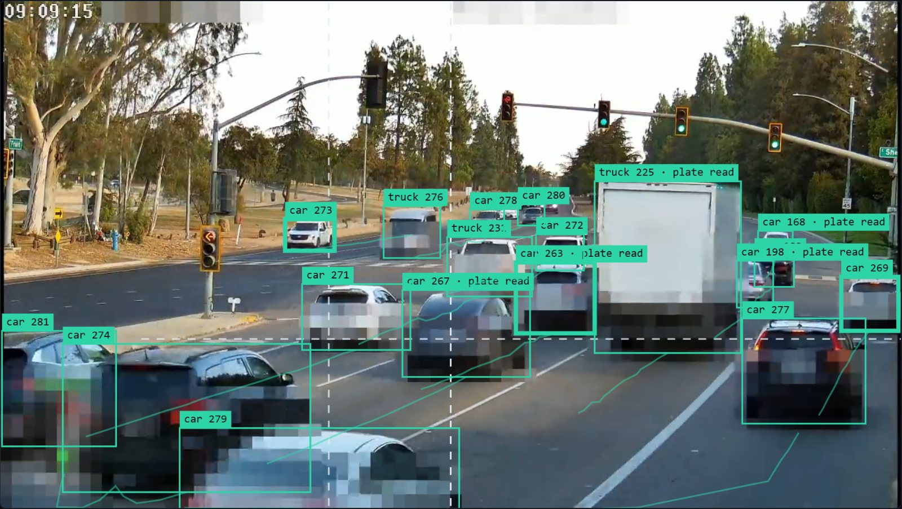
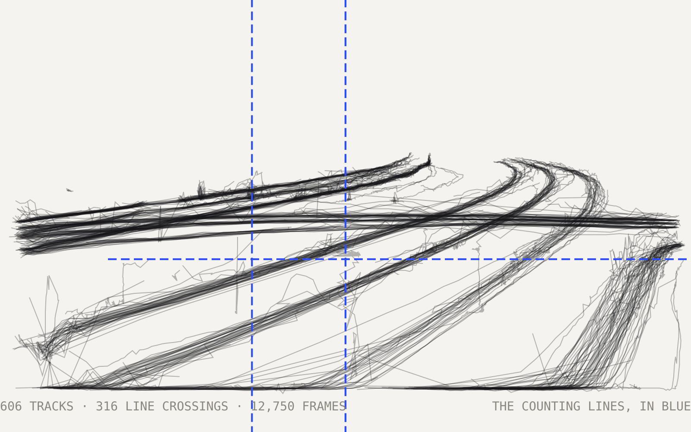
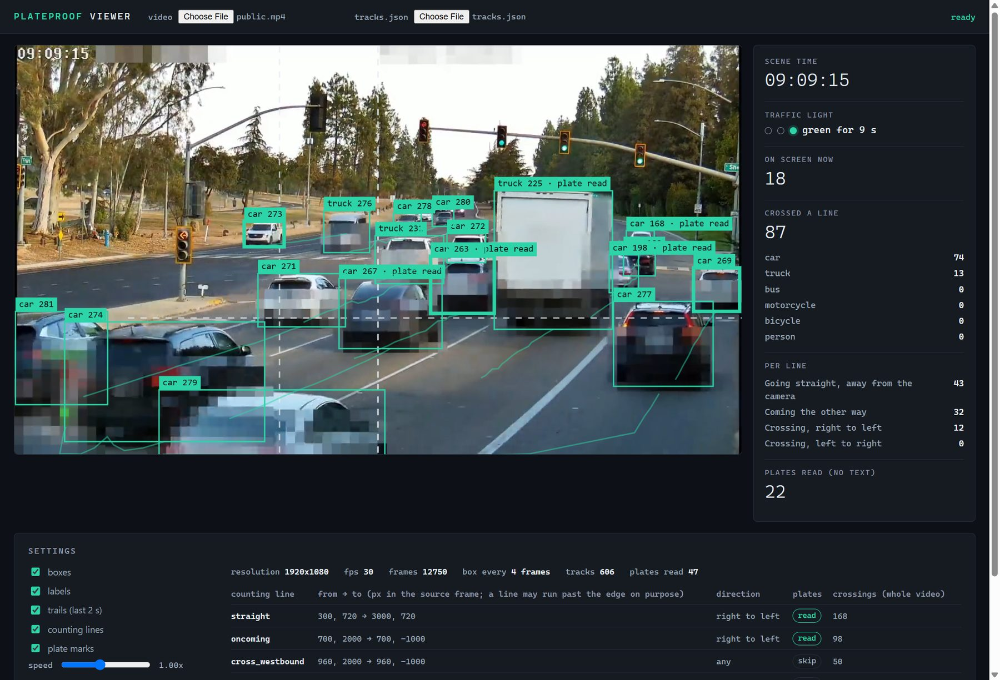
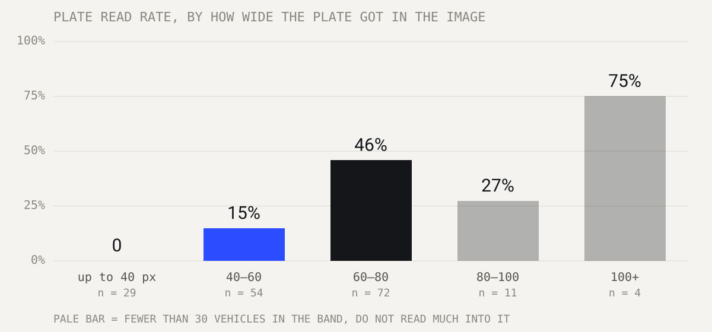
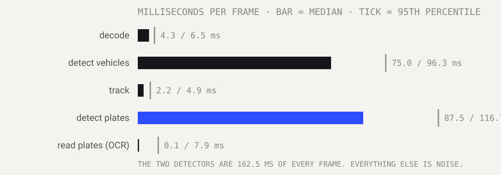

# Plateproof

Turn video from a fixed camera into numbers — vehicles counted by class and direction, traffic-light phases
read from the lamps themselves, license plates read and then pixelated. **On CPU alone**, with no GPU and no
PyTorch. And before the video goes anywhere, two checks attack it with the same plate reader to prove the
plates are gone.

[](https://github.com/eucleberpaiva/plateproof/actions/workflows/tests.yml)
[](https://www.python.org/)
[](https://onnxruntime.ai)
[](LICENSE)



▶ **[30-second screen recording of the viewer](docs/media/demo.mp4)** — boxes, trails, live counters and the
traffic light, in sync with the video.

> ### What this is
>
> A lab, not a product. It ships no source footage, no model weights and no results: you bring your own
> video. Everything below was measured on one real scene — 7 minutes of a fixed traffic camera, 12,750 frames
> at 1920x1080, on a laptop with an Intel Core i7-13700H and **no GPU**.
>
> The numbers include what it got wrong. Of the 53 vehicles the model called a truck, 8 were trucks. Four to
> six out of 168 were counted twice. And how many vehicles went by without being counted at all was never
> measured — that number is missing, not rounded away.

---

## Contents

- [What it does](#what-it-does)
- [Measured on a real scene](#measured-on-a-real-scene)
- [Install](#install)
- [Run it on your own video](#run-it-on-your-own-video)
- [How it works](#how-it-works)
- [Calibrating a scene](#calibrating-a-scene)
- [Performance](#performance)
- [Privacy, and how it is checked](#privacy-and-how-it-is-checked)
- [What is sensitive](#what-is-sensitive)
- [Project layout](#project-layout)
- [Known limits](#known-limits)
- [How to contribute](#how-to-contribute)
- [Credits](#credits)
- [License](#license)

---

## What it does

| Step | Command | What comes out |
|---|---|---|
| 0. Models | `python -m plateproof.models` | 3 ONNX models from their original source, SHA-256 verified |
| 1. Analyze | `python -m plateproof.analyze` | vehicles, tracks, plates and traffic lights, frame by frame, with the time each stage took |
| 2. Summarize | `python -m plateproof.summarize` | counts per line and class, light phases, plate read rate |
| 3. Hide plates | `python -m plateproof.privacy` | `public.mp4`, with the plates pixelated |
| 4. Check | `python -m plateproof.verify` and `python -m plateproof.sample` | an automatic attack on that video, plus whole frames to review by eye |
| View | `viewer/index.html` | video, boxes, trails, counting lines and live counters, in the browser |

Every vehicle that crosses a counting line is counted once, on the first line in the scene that it crosses.
Below is every path the 606 tracked vehicles took through those 7 minutes, drawn from the coordinates the
pipeline wrote — no video, just the numbers. The three counting lines are in blue.





## Measured on a real scene

The calibration for this scene is in [`scenes/example-intersection.toml`](scenes/example-intersection.toml).
What step 2 prints at the end of the run:

```
316 vehicles counted across 606 tracks
  straight             car 137  truck 30  motorcycle 1
  oncoming             car 86  truck 12
  cross_westbound      car 39  truck 11
plates: 47 read out of 266 candidates (170 had a plate detected)
traffic light: 3 full cycles
ok -> out/summary.json, tracks.json (publishable); audit.json and texts.json (SENSITIVE)
```

- **316 vehicles counted** across 3 movements: 168 going straight, 98 coming the other way, 50 crossing.
- **3 full traffic light cycles** read from lens brightness, with no connection to the controller.
- **47 plates read** out of 266 passes where a plate faced the camera.
- **5.5 frames per second** with everything switched on. The two detectors are 162.5 ms of every frame;
  everything else is noise.

And what the manual review found in those numbers:

| Checked by hand | Result |
|---|---|
| The 47 plates read | 32 exactly right · 11 with one character wrong, nearly always an 8 read as a B · 4 unreadable even by eye |
| The 53 vehicles called "truck" | 8 were trucks. The rest: 24 pickups, 13 vans, 3 trailers, 5 SUVs — COCO calls all of those a truck |
| The 168 going straight | 4 to 6 counted twice: a trailer comes in separately from the vehicle towing it, and a pole makes the tracker switch IDs |
| Vehicles that went by uncounted | **Never measured.** This one is missing |

What decided the plate read rate was not the model. It was how wide the plate got in the image:



This camera was installed to show the intersection, not to read plates. For a gate camera built for it, Axis
asks for a plate 130 px wide — a requirement no change of model can satisfy after the fact.

## Install

You need **Python 3.12 or newer** (developed on 3.14) and [FFmpeg](https://ffmpeg.org) on your PATH, which
only step 3 uses.

### 1. Get the project

```bash
git clone https://github.com/eucleberpaiva/plateproof.git
cd plateproof
```

### 2. Create a virtual environment

This keeps the libraries of this project separate from the rest of your system.

**Windows:**
```bash
python -m venv .venv
.venv\Scripts\activate
```

**Linux or macOS:**
```bash
python3 -m venv .venv
source .venv/bin/activate
```

### 3. Install the dependencies

```bash
python -m pip install --require-hashes -r requirements.txt
```

`--require-hashes` makes pip refuse any package whose hash is not the one pinned in `requirements.txt`. It
also forces every transitive dependency to be pinned, so nothing floats.

### 4. Download the models

```bash
python -m plateproof.models
```

Three ONNX files, about 100 MB, each downloaded from its original source and checked against a pinned
SHA-256. If a source ever swaps a file, the download fails instead of silently running a different model.
Nothing is redistributed here.

### 5. Check the install

```bash
python -m unittest
```

17 tests, and they need no video and no model.

## Run it on your own video

**1. Pull a few frames to calibrate against.**

```bash
cp scenes/example-intersection.toml scenes/my-scene.toml
python -m plateproof.sample my-video.mp4 out --n 3
```

Open the frames in `out/sheets/` in any image editor that shows the cursor position and write down the
coordinates. Every field is explained inside the file, and [Calibrating a scene](#calibrating-a-scene) below
lists what each one does. `scenes/*.toml` is git-ignored, so your calibration never ends up in a commit by
accident.

**2. Run it.** Try a few frames before feeding it the whole video:

```bash
python -m plateproof.analyze my-video.mp4 scenes/my-scene.toml out --max 300
python -m plateproof.summarize scenes/my-scene.toml out
```

Only want the counts? Run `analyze` with `--no-text`: plates are still detected so they can be pixelated,
but no plate text and no crop is ever written.

**3. Watch it.** Open `viewer/index.html` in your browser and pick your video and `out/tracks.json`. Nothing
leaves your machine: the page makes no network request at all (`default-src 'none'`).

**4. Before you show the video to anybody:**

```bash
python -m plateproof.privacy my-video.mp4 scenes/my-scene.toml out
python -m plateproof.verify out/public.mp4 scenes/my-scene.toml out
python -m plateproof.sample out/public.mp4 out --n 24
```

See [Privacy, and how it is checked](#privacy-and-how-it-is-checked) — including why you should run the
attack on your **original** video first.

## How it works

```
  video ──► detect vehicles ──► track ──► count per line ──► summary.json
            YOLOX-s, ONNX        ByteTrack   side of segment
                │                                              
                ├──► detect plates ──► read plate ──► vote per character
                │    YOLOv9-s-608      cct-xs-v2      3+ reads, 75% agreement
                │                                              
                └──► traffic light ──► phase
                     lens brightness   half-second majority
```

**Vehicles.** YOLOX-s finds cars, trucks, buses, motorcycles, bicycles and people in every frame, straight on
ONNX Runtime with no PyTorch. Each track's class is decided by a vote weighted by per-frame confidence, so a
car the detector called a truck for two frames is still a car.

**Counting.** A vehicle is represented by the middle of the bottom edge of its box — where it touches the
ground. Picture someone walking from the line's `from` to its `to`: the line counts whoever passes from that
person's right-hand side to the left. A line may also require a total displacement, which is what separates a
vehicle going straight from one that only clips the line while turning.

**Traffic light.** No integration with any controller: a box covers each lamp housing and the code measures
the brightness of each third of it. A lit lens goes past 230 and sits at least 50 above the second brightest.
Two details keep it stable — when two lights control the same flow the state only counts if both agree, and
the state of a frame is the majority over a half-second window, so a truck passing in front does not open a
fake phase.

**Plates.** Every read of the same vehicle votes, character by character, weighted by the confidence of each
read. A plate only counts as read with 3 reads or more and 75% mean agreement.

Every stage, and the measurement behind each decision, is in [`docs/how-it-works.md`](docs/how-it-works.md).

## Calibrating a scene

The scene file is the only thing you have to write by hand, and it is what makes the counting mean anything.
Values below are the ones from the example scene.

| Field | Example | What it does |
|---|---|---|
| `detection.vehicle_conf` | `0.35` | Confidence floor for the vehicle detector |
| `detection.plate_conf` | `0.25` | Confidence floor for the plate detector |
| `detection.ocr_plate_conf` | `0.4` | Only read plates detected with at least this confidence… |
| `detection.ocr_min_width` | `40` | …and at least this wide in pixels. Below it the OCR is guessing |
| `detection.ignore` | 3 boxes | Areas that are never read or counted as a plate: logo, clock, station ident |
| `tracking.min_frames` | `20` | A track shorter than this (0.67 s at 30 fps) is detector noise |
| `[[light]].box` | `[1446, 231, 14, 51]` | The whole lamp housing: red on the top third, yellow, green |
| `[[light]].flow` | `true` | This light defines the phase that gets crossed with the counts |
| `light_reading.lit` | `230` | Brightness a lens has to pass to count as lit (lit reads ~255 here, unlit 110–160) |
| `light_reading.margin` | `50` | How far it has to sit above the second brightest lens |
| `[[line]].from` / `to` | `[300, 720]` → `[3000, 720]` | The counting line, in pixels of the source frame. It may run past the edge on purpose |
| `[[line]].direction` | `right_to_left` | Which way a crossing counts, or `any` |
| `[[line]].dy` | `[-inf, -60]` | Required total displacement — what separates going straight from clipping the line while turning |
| `[[line]].plates` | `true` | Whether plates are read for vehicles crossing this line |
| `privacy.min_height` | `100` | A vehicle box this tall or taller always gets its lower band pixelated |
| `privacy.band` | `[-0.05, 0.30, 1.05, 1.05]` | The band, as a fraction of the box. 99% of detected plates start below 38% of the box height |
| `privacy.frame_slack` | `5` | The band also applies this many frames before and after the track exists |
| `privacy.block` | `24` | Mosaic cell in pixels. A whole plate here is 22 px tall at the median |
| `privacy.masks` | `[[215, 0, 560, 46]]` | Areas pixelated in every frame — a burned-in date, an overlay from your own system |
| `clock.start` | commented out | Optional wall clock of frame 0. **Left out on purpose:** publishing it publishes the time of day of your recording |

## Performance

The whole video ran at **5.5 frames per second**. Where each frame goes:



The OCR sits near zero at the median because it only runs when a plate is wide enough; its p95 is 7.9 ms.

It did not start at 5.5. The first 300-frame test ran at **1.3 frames per second**, and the processor was not
busy with inference: three ONNX Runtime sessions were keeping threads spinning idle, waiting for work, and
fighting for the same cores. Switching that off (`session.intra_op.allow_spinning = 0`) took the same test to
4.8 frames per second.

Every timing here was measured on onnxruntime 1.24.4, which is why that version is pinned.

## Privacy, and how it is checked

A plate is personal data, so hiding it is not a finishing touch — it is a step with its own checks.

**Three layers,** because no detector is right in every frame: every detected plate with margin; the lower
band of every vehicle box 100 px tall or more, in every frame plus 5 before and after the track exists; and
fixed masks for anything burned into the image.

**Then the video is attacked.** The same plate reader, more sensitive than in the analysis, runs over the
shareable video upscaled back to the original resolution — which is what somebody would do to try to read it.

**And the attack itself is checked.** Zero flags means nothing until you have seen the same command light up
on unpixelated footage. On the example scene:

| | Frames | Plate-shaped reads | Within 2 characters of a real plate |
|---|---|---|---|
| **Control** — the original video | 400 | 224 | 142 (minimum edit distance 0 — exact hits) |
| **The published video** | 12,750 | **0** | **0** |

A check that can only pass is not a check.

The method, the three attempts that failed before it, and what these checks cannot prove are in
[`docs/privacy.md`](docs/privacy.md).

## What is sensitive

| File | Contains | Publishable? |
|---|---|---|
| your source video | people and plates | no |
| `out/raw.json.gz` | text of every plate read, frame by frame | no |
| `out/crops/`, `out/audit.json`, `out/texts.json`, `out/sheets/` | plate images and text | no |
| `out/summary.json`, `out/tracks.json` | numbers, boxes and crossings, no plate text | yes, with the note below |
| `out/public.mp4` | video with plates pixelated; **faces are not handled** | only after step 4, and only if no face is recognizable |

`tracks.json` also carries what you typed into the scene file: the name and label of every counting line and
the wall clock of frame 0. Name a line after a street and you publish the location; keep `[clock]` and you
publish the time of day of the recording.

`summary.json` and `tracks.json` are checked before they are written: if any plate text shows up in them,
nothing is written. `out/`, videos, images and models are git-ignored, and a test fails if any of them ever
gets committed.

**Responsible use.** A license plate can identify a person. Brazil has the LGPD, and other places have
specific rules for automatic plate reading. Before you point this at a camera: use footage you have the right
to use, publish only what came through step 4, and delete `raw.json.gz`, `crops/`, `audit.json` and
`texts.json` when the review is over. The license does not allow anyone to break the law.

## Project layout

```
plateproof/
├── plateproof/
│   ├── core.py          rules with no model in them: counting, light state, plate vote, pixelation
│   ├── models.py        downloads the 3 ONNX models and checks the SHA-256 of each one
│   ├── yolox.py         the vehicle detector on ONNX Runtime, without PyTorch
│   ├── analyze.py       step 1 · one pass over the video, timing every stage
│   ├── summarize.py     step 2 · turns the per-frame file into numbers and into the viewer file
│   ├── privacy.py       step 3 · the shareable video, with the plates hidden
│   ├── verify.py        step 4a · attacks that video with the same plate reader
│   ├── sample.py        step 4b · pulls whole frames out for the visual review
│   └── audit.py         contact sheets for checking the numbers by hand (SENSITIVE)
├── scenes/
│   └── example-intersection.toml   the calibration behind every number in this README
├── viewer/
│   └── index.html       the whole viewer, one file, no network request
├── docs/
│   ├── how-it-works.md  every stage, why it is built that way and what was measured
│   ├── privacy.md       the method, the attempts that failed, and what the checks cannot prove
│   └── charts/          the drawings in this README, and make_charts.py, which regenerates them
│                        from out/tracks.json and out/summary.json
└── tests/
    └── test_plateproof.py   17 tests, no video and no model needed
```

## Known limits

- **Brazilian plates:** the reader (`cct-xs-v2-global`) has not been tested against Mercosur plates, only
  against the US plates in this scene.
- **Speed:** 5.5 frames per second is not real time for 30 fps video. Every timing here was measured on
  onnxruntime 1.24.4; a different runtime version is a different measurement, so that one is pinned until it
  is re-measured.
- **Tracker:** ByteTrack was dropped from `supervision` in 0.31, which is why the version is pinned. The
  pinned version prints a `FutureWarning` about it on every run; nothing is broken.
- **Privacy:** the layer that covers undetected plates depends on the vehicle detector, so a vehicle and a
  plate missed in the same frame is not covered automatically, which is what the visual review is for. Faces
  are not handled, and neither is anything else that identifies somebody: the company name painted on a van,
  a bumper sticker, a school badge. Only the plate is treated as personal data here. The mosaic has not been
  tested against reconstruction attacks that combine many frames.

## How to contribute

It is a lab: issues are welcome, with no promise of a response time. A few things worth measuring:

- **Missed vehicles:** count a stretch by hand and compare it with the automatic count — the number this
  README is missing.
- **Tracker:** swap ByteTrack for a maintained one and compare the double counts.
- **Privacy:** an attack that combines several frames to try to reconstruct the mosaic, and a way to handle
  faces.

Run `python -m unittest` before sending a PR, and never attach video or images with a readable plate or face,
not even in an issue.

## Credits

- **The footage** in the screenshots and the recording above comes from the public live stream of
  [Friant Roulette](https://www.youtube.com/@friantroulette) on YouTube, which points at a road intersection
  around the clock. The clock and the overlay graphics in the frame are theirs. The plates are pixelated and
  the date is masked, both by this pipeline. No source footage is redistributed in this repository.
- **Vehicle detection:** [YOLOX](https://github.com/Megvii-BaseDetection/YOLOX), Megvii, Apache-2.0. Trained
  on [COCO](https://cocodataset.org) (Lin et al., 2014), annotations under CC BY 4.0.
- **Plate detection:** [open-image-models](https://github.com/ankandrew/open-image-models), ankandrew, MIT.
  [YOLOv9](https://arxiv.org/abs/2402.13616) architecture (Wang, Yeh and Liao, 2024).
- **Plate reading:** [fast-plate-ocr](https://github.com/ankandrew/fast-plate-ocr) and
  [fast-alpr](https://github.com/ankandrew/fast-alpr), ankandrew, MIT.
- **Tracking:** ByteTrack (Zhang et al., 2022) through
  [supervision](https://github.com/roboflow/supervision), Roboflow, MIT.
- **Runtime:** [ONNX Runtime](https://onnxruntime.ai) (MIT), [OpenCV](https://opencv.org) (Apache-2.0),
  [FFmpeg](https://ffmpeg.org) (LGPL/GPL).

No model weights are redistributed here. Each one is downloaded from its original source, and it is worth
checking each model's license for your own use.

## License

Code under [MIT](LICENSE). © 2026 Cleber Paiva · [cleberpaiva.com.br](https://cleberpaiva.com.br)
